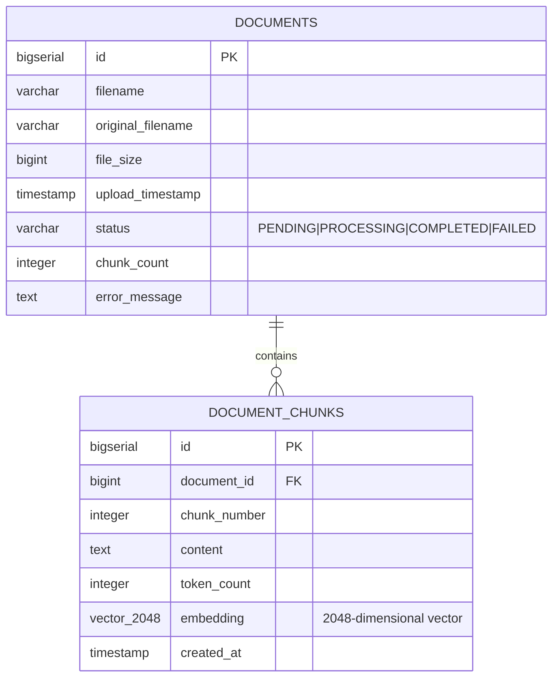

# Principal-Level Guide

## The Core Insight

This is a **production-grade RAG (Retrieval-Augmented Generation) system** that transforms static PDFs into queryable knowledge bases using vector similarity search and LLM-powered responses.

**The architectural breakthrough**: Async document processing + circuit breaker + intelligent caching = a system that handles external API failures gracefully while maintaining sub-100ms response times for cached queries.

### In Python Terms (for comparison)
```python
# The core RAG flow
async def rag_pipeline(pdf_file, user_query):
    # 1. Document Processing (async)
    chunks = await chunk_document(pdf_file, chunk_size=500, overlap=50)
    embeddings = await generate_embeddings(chunks)  # NVIDIA API
    await store_in_vector_db(chunks, embeddings)    # PostgreSQL pgvector
    
    # 2. Query Processing (with caching + circuit breaker)
    @cache(ttl=3600)
    @circuit_breaker(failure_threshold=0.5)
    async def query_with_context(query):
        query_embedding = await generate_embedding(query)
        relevant_chunks = await vector_search(query_embedding, top_k=5)
        context = "\n".join([c.content for c in relevant_chunks])
        return await llm_generate(context, query)  # NVIDIA LLM
    
    return await query_with_context(user_query)
```

## System Architecture

```mermaid
graph TB
    Client[Client] -->|POST /api/documents| Upload[UploadController]
    Client -->|POST /api/chat/query| Chat[ChatController]
    
    Upload -->|202 Accepted| AsyncProc[PdfProcessingService @Async]
    
    AsyncProc -->|Extract Text| PDFBox[Apache PDFBox]
    AsyncProc -->|Chunk| Chunker[DocumentChunkerImpl]
    AsyncProc -->|Generate Embeddings| EmbedSvc[EmbeddingServiceImpl]
    
    EmbedSvc -->|@Cacheable| Cache[Caffeine Cache]
    EmbedSvc -->|Batch API Calls| NvidiaEmbed[NvidiaEmbeddingClient]
    
    Chat -->|Query| ChatSvc[ChatServiceImpl]
    ChatSvc -->|Vector Search| Retrieval[RetrievalServiceImpl]
    ChatSvc -->|Generate Response| Resilient[ResilientNvidiaChatClient]
    
    Resilient -->|@CircuitBreaker @Retry| NvidiaChat[NvidiaChatClient]
    
    Retrieval -->|Cosine Similarity| PgVector[(PostgreSQL + pgvector)]
    AsyncProc -->|Store Chunks| PgVector
    
    style Cache fill:#90EE90
    style Resilient fill:#FFB6C1
    style AsyncProc fill:#87CEEB
```

## Domain Model



## Design Tradeoffs

### 1. Async Processing vs Synchronous
**Chosen**: Async with polling  
**Why**: HTTP timeouts are unacceptable for 30-120s PDF processing  
**Cost**: Client complexity (polling), eventual consistency  
**Benefit**: Horizontal scalability, better resource utilization

### 2. In-Memory Cache (Caffeine) vs Distributed (Redis)
**Chosen**: Caffeine for Phase 1  
**Why**: Single-instance deployment, zero infrastructure overhead  
**Cost**: Cache not shared across instances  
**Benefit**: Sub-millisecond latency, no network calls  
**Migration Path**: Redis when scaling horizontally

### 3. Circuit Breaker vs Retry-Only
**Chosen**: Circuit Breaker + Retry  
**Why**: Prevents cascading failures when NVIDIA API is down  
**Cost**: Complexity in monitoring circuit states  
**Benefit**: Fast failure, automatic recovery detection

### 4. IVFFlat vs HNSW Index
**Chosen**: IVFFlat for pgvector  
**Why**: HNSW limited to 2000 dimensions, we use 2048  
**Cost**: Slightly slower queries than HNSW  
**Benefit**: Supports our embedding dimensions

### 5. Spring AI vs Custom HTTP Clients
**Chosen**: Hybrid (Spring AI for chat, custom for embeddings)  
**Why**: Spring AI doesn't support NVIDIA embedding model  
**Cost**: Maintaining two client types  
**Benefit**: Leverage Spring AI features where possible

## Strategic Direction

### Current State (Phase 1)
- Single-instance deployment
- In-memory caching
- Async processing with thread pool
- PostgreSQL with pgvector

### Phase 2: Scaling (100-1000 users)
- Redis for distributed caching
- RabbitMQ/Kafka for document processing queue
- Database read replicas
- Horizontal pod autoscaling
- JWT authentication

### Phase 3: Enterprise (1000+ users)
- Dedicated vector database (Pinecone/Weaviate)
- Microservices architecture
- API Gateway (Kong)
- Multi-region deployment
- Advanced observability (OpenTelemetry)

## Where to Go Deep

### For Backend Engineers
1. Start: `ChatServiceImpl.java:47` - Core RAG logic
2. Then: `ResilientNvidiaChatClient.java` - Resilience patterns
3. Finally: `RetrievalServiceImpl.java` - Vector search implementation

### For DevOps Engineers
1. Start: `AsyncConfig.java` - Thread pool configuration
2. Then: `ResilienceConfig.java` - Circuit breaker tuning
3. Finally: `application.properties` - All configuration knobs

### For Security Engineers
1. Start: `SecurityConfig.java:32` - Security filter chain
2. Then: `GlobalExceptionHandler.java` - Error handling
3. Finally: Rate limiting implementation in SecurityConfig

## Key Metrics to Monitor

```properties
# Circuit Breaker State
resilience4j.circuitbreaker.state == OPEN  # Alert!

# Cache Hit Rate
cache.gets.hit / cache.gets.total > 0.6  # Target 60%+

# Async Thread Pool
executor.active / executor.pool.size < 0.8  # Keep below 80%

# API Latency
http.server.requests.p99 < 3s  # 99th percentile

# Document Processing
documents.status == FAILED  # Investigate failures
```

## Critical Files

| File | Purpose | Lines | Complexity |
|------|---------|-------|------------|
| `ChatServiceImpl.java` | RAG orchestration | 200 | High |
| `ResilientNvidiaChatClient.java` | Resilience wrapper | 150 | Medium |
| `RetrievalServiceImpl.java` | Vector search | 180 | Medium |
| `PdfProcessingServiceImpl.java` | Async document processing | 220 | High |
| `SecurityConfig.java` | Security + CORS + Rate limiting | 120 | Medium |

**References**:
- Architecture: `demo/docs/ARCHITECTURE_IMPROVEMENTS.md`
- ADR: `demo/docs/ADR-001-async-processing-and-resilience.md`
- Schema: `demo/src/main/resources/schema.sql:1`
- Config: `demo/src/main/resources/application.properties:1`
